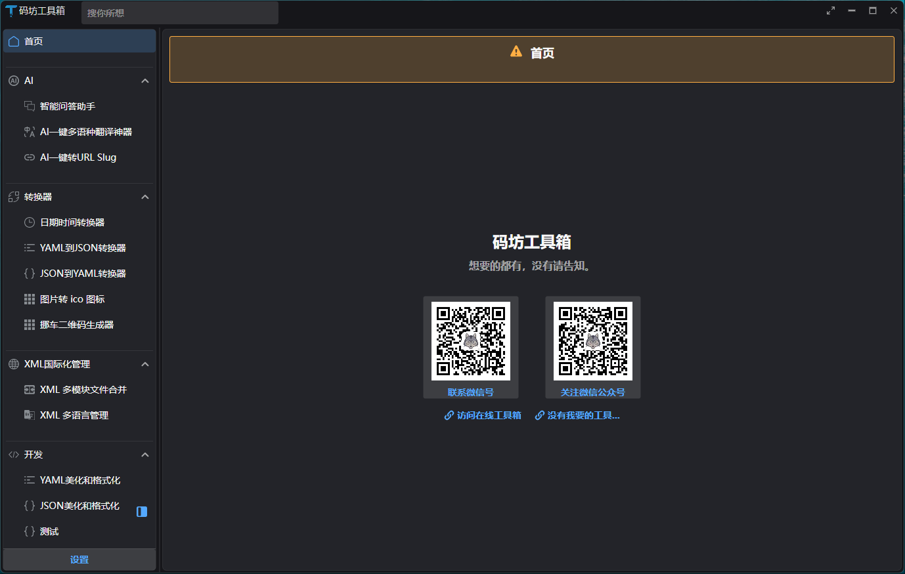

# CodeWF Toolbox

English | [简体中文](README.zh-CN.md)

CodeWF Toolbox is an Avalonia + Prism modular desktop toolbox for developer productivity scenarios. It keeps the shell, shared services, and feature modules separated so new tools can be added without turning the main application into one large window class.



## Highlights

- Cross-platform desktop UI based on Avalonia UI and Semi/Ursa controls.
- Prism module catalog, dependency injection, and region navigation.
- XML-based internationalization with Simplified Chinese, Traditional Chinese, English, and Japanese resources.
- Tool modules for format converters, log viewing, development utilities, web helpers, security tools, and XML translation management.
- Native AOT-oriented publishing scripts and platform constants.
- Improved menu registration, searchable tool navigation, and safer region navigation.

## Documentation

- [Developer guide](docs/README.md)
- [中文开发文档](docs/README.zh-CN.md)
- [Architecture SVG](docs/assets/architecture.svg)
- [Module lifecycle SVG](docs/assets/module-lifecycle.svg)


## Quick Start

Requirements:

- .NET 11 SDK
- Windows, macOS, or Linux desktop runtime supported by Avalonia

```powershell
dotnet restore CodeWF.Toolbox.slnx
dotnet build CodeWF.Toolbox.slnx
dotnet run --project src/CodeWF.Toolbox/CodeWF.Toolbox.csproj
```

## Solution Layout

```text
src/
  CodeWF.Toolbox/                    Desktop app, shell, main views, settings, resources
  CodeWF.Core/                       Shared abstractions, services, regions
  CodeWF.Controls/                   Shared controls
  CodeWF.Modules.Converter/          Converter tools
  CodeWF.Modules.ToolFramework/      Shared local toolbox runtime and tool catalog
  CodeWF.Modules.Development/        Development tools
  CodeWF.Modules.LogViewer/          Large-file log viewer with tail monitoring
  CodeWF.Modules.XmlTranslatorManager/ XML i18n management tools
  CodeWF.Toolbox.Tests/              Unit test project
docs/
  assets/                            Standalone SVG diagrams
```

## Adding a Module

1. Create a module project under `src/CodeWF.Modules.*`.
2. Implement `IModule`.
3. Register menu entries through `IToolMenuService`.
4. Register views with `RegionNames.ContentRegion`.
5. Add the module to `App.ConfigureModuleCatalog`.
6. Add localization XML files and generated language keys.

See the developer guide for the detailed conventions.

## Included Tools

- Log Viewer: opens large log files quickly, renders only the visible range, and follows appended content when tail mode is enabled.
- Format converters: JSON/YAML, Base64, GUID, date-time, and image-to-icon utilities.
- Development helpers: JSON/YAML formatting, shell and data utilities, and small productivity tools.
- XML translation manager: compares, merges, and maintains XML localization resources.
