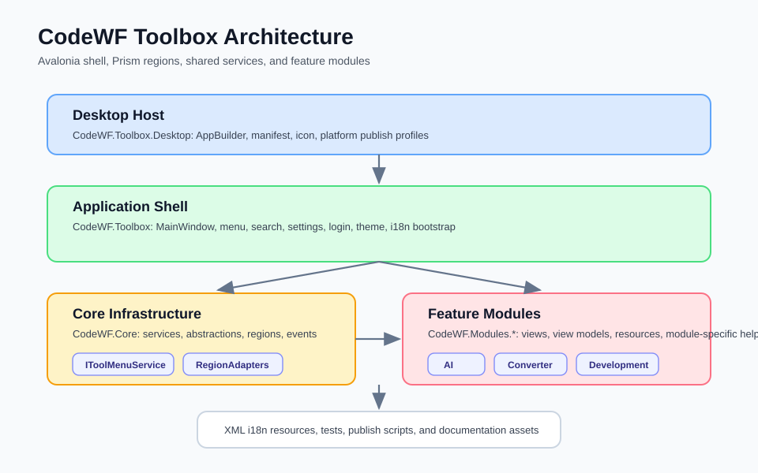
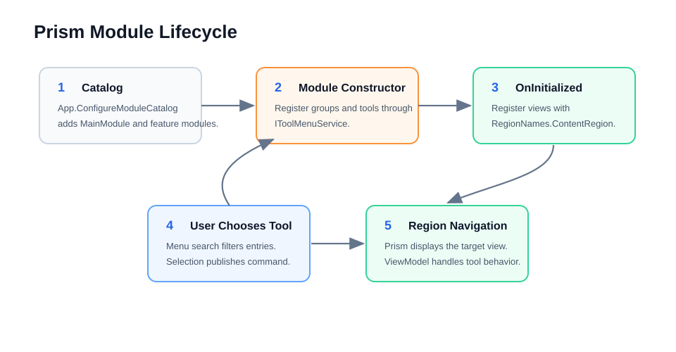

# 码坊工具箱开发文档

[English](README.md) | 简体中文

本文档面向想学习 Avalonia + Prism 模块化开发的读者，说明项目边界、模块接入方式、国际化资源和发布检查点。

## 架构概览



整体分为五层：

- `CodeWF.Toolbox.Desktop`：桌面启动入口，负责创建 Avalonia AppBuilder、应用图标、Manifest 和发布配置。
- `CodeWF.Toolbox`：应用 Shell，包含主窗口、菜单、设置、主题、登录窗口和模块目录配置。
- `CodeWF.Core`：公共基础层，提供服务接口、文件选择、通知、工具菜单、Region 名称与 TabControl 适配器。
- `CodeWF.Modules.*`：业务模块层，每个模块只注册自己的菜单、View、ViewModel 和资源。
- `docs`/`tests`/`publish`：文档、验证项目和发布脚本。

## 模块生命周期



启动时，`App.ConfigureModuleCatalog` 把模块加入 Prism 模块目录。模块构造函数负责把工具入口注册到 `IToolMenuService`；`OnInitialized` 将 View 注册到 `RegionNames.ContentRegion`。用户点击菜单后，Shell 通过 Prism Region 导航到对应页面。

## 关键约定

- 菜单名称和描述应使用本模块 `Localization.*` 生成的资源键。
- 工具页面名称使用 `nameof(MyToolView)`，避免字符串拼写漂移。
- 模块只依赖 `CodeWF.Core` 暴露的接口，不直接依赖主壳内部实现。
- 工具状态使用 `ToolStatus` 标记：`Planned`、`Developing`、`Complete`。
- 复杂控件初始化可以放在 View 的 code-behind，但业务行为应放到 ViewModel。
- 新增公共能力时优先放到 `CodeWF.Core` 的接口与服务实现中。

## 新增工具模块

1. 新建项目：`src/CodeWF.Modules.YourModule`。
2. 引用 `CodeWF.Core` 和 Prism/Avalonia 相关包。
3. 创建 `YourModule : IModule`。
4. 在构造函数中调用 `IToolMenuService.AddGroup` 和 `AddItem`。
5. 在 `OnInitialized` 中调用 `RegisterViewWithRegion<TView>(RegionNames.ContentRegion)`。
6. 在 `RegisterTypes` 中注册特殊 ViewModel、Dialog 或服务。
7. 添加 `I18n/*.xml`，并生成或更新 `I18n/Language.cs`。
8. 在 `CodeWF.Toolbox/App.axaml.cs` 的模块目录中加入模块。

示例：

```csharp
public class DemoModule : IModule
{
    public DemoModule(IToolMenuService toolMenuService)
    {
        var groupName = Localization.DemoModule.Title;
        toolMenuService.AddSeparator();
        toolMenuService.AddGroup(groupName, Icons.Demo);
        toolMenuService.AddItem(
            Localization.DemoView.Title,
            groupName,
            Localization.DemoView.Description,
            nameof(DemoView),
            Icons.Demo,
            ToolStatus.Developing);
    }

    public void OnInitialized(IContainerProvider containerProvider)
    {
        var regionManager = containerProvider.Resolve<IRegionManager>();
        regionManager.RegisterViewWithRegion<DemoView>(RegionNames.ContentRegion);
    }

    public void RegisterTypes(IContainerRegistry containerRegistry)
    {
    }
}
```

## 国际化

每个模块维护自己的 XML 资源文件，例如：

- `I18n/YourModule.zh-CN.xml`
- `I18n/YourModule.en-US.xml`
- `I18n/YourModule.ja-JP.xml`
- `I18n/YourModule.zh-Hant.xml`

建议保持所有语言文件节点一致。菜单、按钮、提示和错误消息都应走资源键，不要在 XAML 或 ViewModel 中散落固定文本。确实需要异常兜底文本时，应保持简短，并优先用于开发期定位。

## 代码质量检查

提交前建议执行：

```powershell
dotnet restore CodeWF.Toolbox.slnx
dotnet build CodeWF.Toolbox.slnx
dotnet test tests/CodeWF.Toolbox.Tests/CodeWF.Toolbox.Tests.csproj
```

关注点：

- 新增工具能从菜单搜索到，并能正确导航。
- 分组、分隔符不会触发空导航。
- 文件选择、剪贴板、拖放等桌面能力有空值和取消操作保护。
- ViewModel 中的异步方法要么 `await`，要么明确返回 `Task.CompletedTask`。
- 多语言资源在至少中文和英文下能正常显示。

## 发布

仓库保留了 `publish.bat`、`publish_win-x64.bat`、`publish_all.bat` 和若干 PublishProfile。发布前确认：

- `Directory.Build.props` 中的 Avalonia、DataGrid 和平台常量符合目标平台。
- `GlobalAssemblies/GlobalAssembly.cs` 中版本号和产品描述已更新。
- 发布脚本输出目录不会覆盖需要保留的旧版本。

## 已知后续方向

- 收敛剩余 nullable 警告，尤其是 XML 翻译管理模块的文件路径和资源文本。
- 为每个工具补充更细的输入校验和失败提示。
- 为核心服务和工具转换逻辑增加更完整的单元测试。
- 把发布脚本整理为跨平台 PowerShell 或 CI 工作流。
